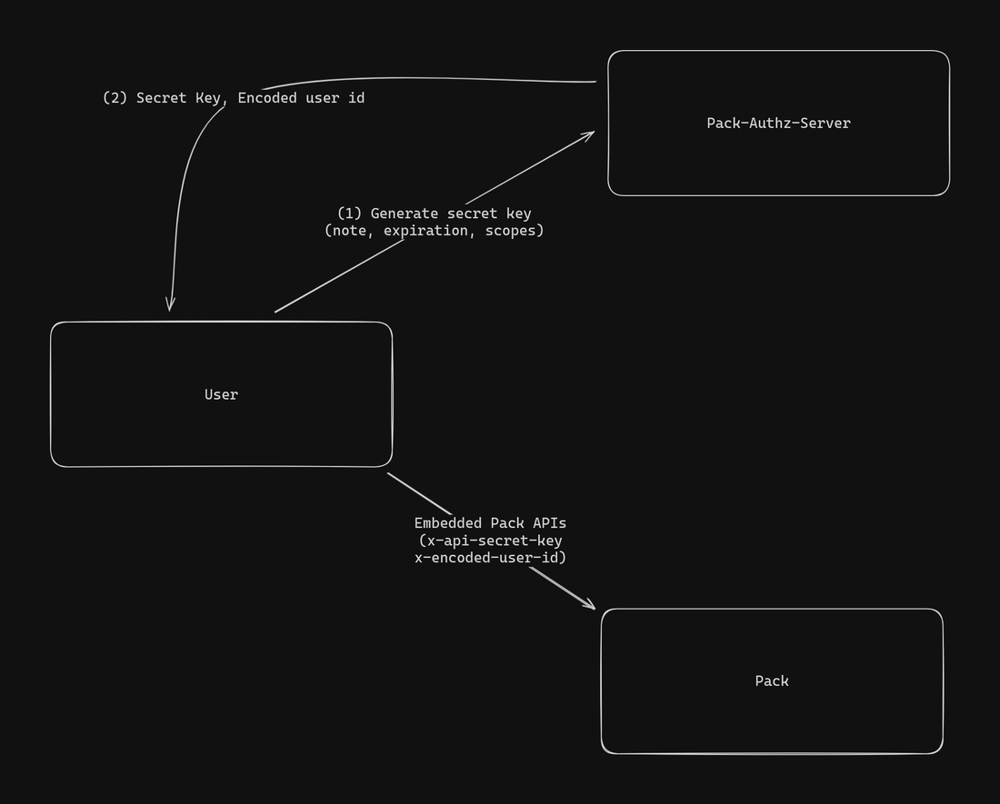
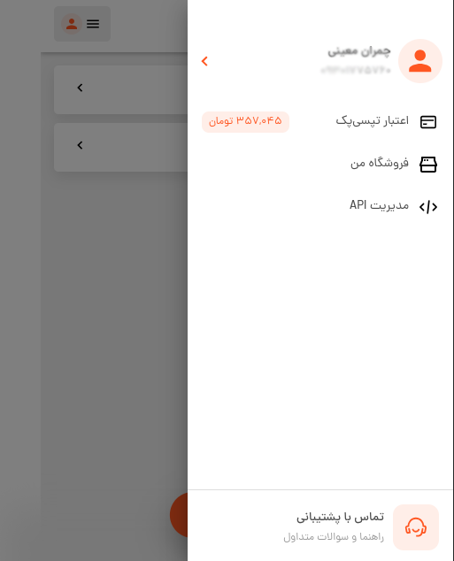
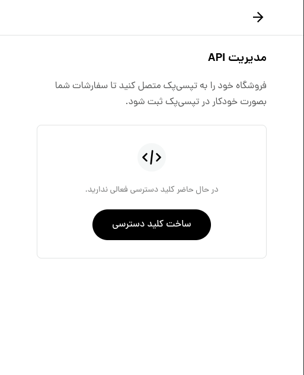
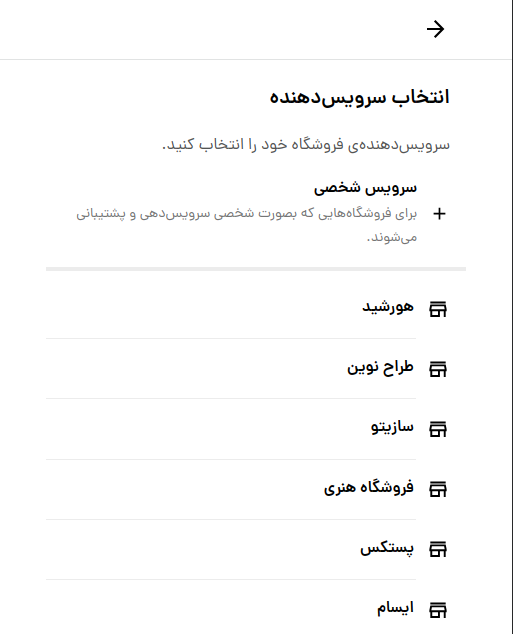
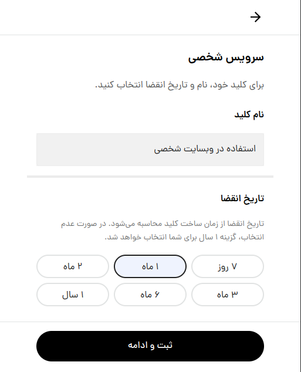
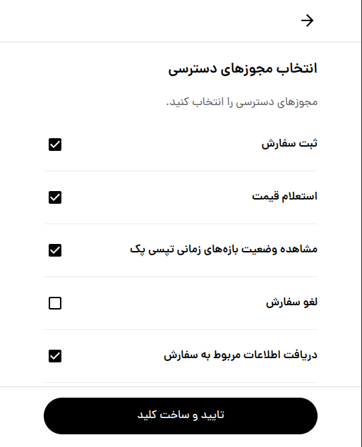
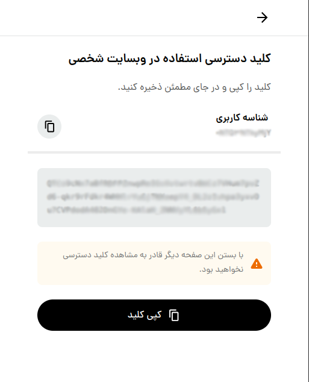

# راهنمای احراز هویت با API Secret Key

در این راهنما احراز هویت در تپسی‌پک به کمک
API Secret Key
آموزش داده می‌شود.

## معرفی

؜
API Secret Key
مانند رمز حساب تپسی‌پک عمل می‌کند.

هر کاربری می‌تواند این کلید 
(که یک
string
رندوم است) را تولید کند و برای استفاده از
API
های تپسی‌پک، به واسطه‌ای این کلید خود را به تپسی‌پک بشناساند.

در تصویر زیر می‌توانید نمای کلی ساخت و استفاده از
API Secret Key
را ببینید:




## ساخت API Secret Key

### ورود به صفحه‌ی مدیریت API تپسی‌پک

برای ساخت
API Secret Key
لازم است ابتدا وارد حساب کاربری خود در تپسی‌پک شوید و سپس به بخش
[مدیریت API](https://pack.tapsi.ir/external-auth)
بروید.

  ؜

گزینه‌ی ساخت کلید دسترسی را انتخاب کنید.

  ؜

### انتخاب نوع کلید

گزینه‌ی **«سرویس شخصی»** را انتخاب کنید که بالاتر از نام همه‌ی
client
ها، در ابتدای لیست قرار دارد.

  ؜

### تعیین مشخصات کلید

حال باید نام کلید و تاریخ انقضای آن را انتخاب کنید.
برای مدیریت راحت‌تر کلیدهایتان، پیشنهاد می‌کنیم نام کلید را کاربرد آن بگذارید، برای مثال نام فروشگاهی که می‌خواهید به کمک این کلید خدمات تپسی‌پک را در آن ارائه دهید.

توجه داشته باشید که با گذشتن تاریخ انقضای انتخاب شده، کلید تولید شده دیگر معتبر نخواهد بود و نمی‌توان با آن از
API
های تپسی‌پک استفاده کرد، در نتیجه حتما توجه داشته باشید که باید پیش از انقضای کلید، یک کلید جدید تولید کنید و آن را جایگزین کلید فعلی نمایید.

  ؜

در مرحله‌ی بعد، باید مجوزهای دسترسی را انتخاب کنید.
مطابق تصویر زیر، لیست
API
های تپسی‌پک را می‌بینید و باید انتخاب کنید که با استفاده از این کلید، قصد استفاده از کدام یک از آن‌ها را دارید.
پیشنهاد می‌کنیم تنها
API
هایی را انتخاب کنید که قصد استفاده از آن‌ها را دارید.
در صورتی که در محصول خود قصد دارید فرآیند کامل ثبت سفارش را پیاده سازی کنید، باید حتما گزینه‌های
«ثبت سفارش»،
«استعلام قیمت»
و
«مشاهده‌ی تاریخ‌های سرویس‌دهی»
(همان
«مشاهده وضعیت بازه‌های زمانی تپسی پک»)
را انتخاب کنید.

می‌توانید اطلاعات این
scope 
ها و توضیحات هر یک را در
[این‌جا](/apis/README.fa.md#مقدمه)
بخوانید.

  ؜

### مشاهده و ذخیره‌ی شناسه‌ی کاربری و API Secret Key تولید شده

در صفحه‌ای مشابه تصویر زیر، می‌توانید شناسه کاربری و کلید خود را ببینید.

  ؜

شناسه‌ی کاربری شما یک مقدار ثابت است. در صورتی که
API Secret Key
فعال داشته باشید، با مراجه به
[مدیریت API](https://pack.tapsi.ir/external-auth)
و انتخاب کلید مي‌توانید آن را مشاهده کنید،
اما توجه داشته باشید کلیدی که در این صفحه مي‌بینید، به صورت رندوم تولید شده است و دیگر به شما نمایش داده نخواهد شد، در نتیجه حتما باید آن را کپی کنید و در جای امنی نگه‌داری کنید.
پیشنهاد می‌کنیم این مقدار را مستقیما در کدهای خود استفاده نکنید و از
environment variable
و یا روش‌های امن دیگر استفاده کنید.

## استفاده از API Secret Key

برای دسترسی به
API
های تپسی‌پک کافی‌ست شناسه‌ی کاربری و
API Secret Key
ای که در
[مرحله‌ی قبل](#مشاهده-و-ذخیره‌ی-شناسه‌ی-کاربری-و-api-secret-key-تولید-شده)
تولید کردید را در
header
درخواست‌هایتان ثبت کنید.
تپسی‌پک به کمک این 
header
ها شما را شناسایی می‌کند.

- کلید
`x-encoded-user-id` :
شناسه کاربری

- کلید
`x-api-secret-key` :
مقدار
API Secret Key
اختصاص داده شده به شما

این یک نمونه درخواست 
[API تاریخ‌های سرویس‌دهی](/apis/time/README.md)
است که در آن برای احراز هویت از
API Secret Key
استفاده شده است.


```bash
curl --location --request GET 'https://api.tapsi.cab/api/v1/delivery/external/embedded/available-dates' \
--header 'x-api-secret-key: 6gJqJu-1eIe9ypYzFh3pwtBkDaltr35Y09Z1zQacuzBcWfMAFFZqQgNdb2q_jWc-CU8wQXaUkEvFBpMIJ7_u24xuWoPABRY-_nyEHXreAATlAxrdTh5-64craO8zm8r2' \
--header 'x-encoded-user-id: MTIz' \
--data-raw ''
```

## حذف API Secret Key

در صورتی که حدس می‌زنید ممکن است کلید شما به دست افراد نامطمئنی افتاده است، حتما کلید خود را حذف کنید و به جای آن یک کلید جدید بسازید.

برای این کار کافی‌ست وارد صفحه‌ی
[مدیریت API](https://pack.tapsi.ir/external-auth)
شوید، کلید مورد نظر را انتخاب کنید، و سپس با انتخاب علامت حذف از گوشه‌ی صفحه، کلید را حذف کنید.

---

[](./README.md)