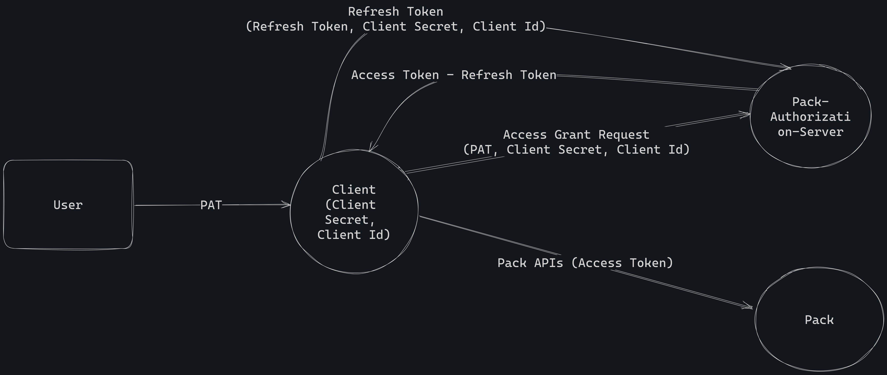

# راهنمای احراز هویت با OAuth

در این راهنما با روش احراز هویت با 
OAuth
در تپسی‌پک آشنا می‌شویم.

## مقدمه

در این راهنما به تیم‌هایی که قصد دارند خدمات تپسی‌پک را به محصول خود اضافه کنند
**client**
گفته می‌شود. 
به هر
client
یک
**client_secret**
منحصر به فرد اختصاص داده می‌شود. برای گرفتن 
**client_secret**
درخواست خود را در
[تپسی‌پک](https://pack.tapsi.ir/landing)
ثبت کنید.

همان‌طور که در
[راهنمای احراز هویت](../README.fa.md)
توضیح داده شد، پس از احراز هویت با
OAuth
شما می‌توانید به جای کاربرانتان در تپسی‌پک سفارش ثبت کنید. برای این کار، باید برای هر یک از کاربرانتان از تپسی‌پک یک
access token
بگیرید و آن را با کلید
**"authorization"**
به
header
درخواست‌هایتان اضافه کنید تا تپسی‌پک اطمینان حاصل کند که این کاربر به شما اجازه داده است تا از طرف او از تپسی‌پک استفاده کنید.

در این راهنما اقدامات لازم برای گرفتن
access token
و مدیریت آن، مرحله به مرحله تشریح می‌شود.




## مدیریت توکن

### ۱. ساخت Personal Access Token (PAT)

ابتدا کاربری که قرار است
client
به جای او سفارش ثبت کند، باید در تپسی‌پک یک
PAT
بسازد و آن را به
client
بدهد.

هر کاربر برای ساخت
PAT
باید این مراحل را طی کند:

۱. **ورود به حساب تپسی‌پک و رفتن به صفحه‌ی مدیریت API:**
  پیش از هر کار،
  client
  باید کاربران خود را به
  [آدرس صفحه‌ی مدیریت API تپسی‌پک](https://pack.tapsi.ir/external-auth)
  هدایت کند.

۲. **انتخاب Client:**
  در این صفحه کاربران می‌توانند لیستی از
  client
  های تپسی‌پک را ببینند و باید
  client
  ای را انتخاب کنند که قصد دارند یک
  PAT
  برایش بسازند و برخی دسترسی‌ها خود را به او بدهند.

  

۳. **اعطای مجوز دسترسی:**
  پس از انتخاب
  client
  مورد نظر، کاربر لیستی از دسترسی‌هایی را می‌بیند که
  client
  مربوطه به آن‌ها نیاز دارند و می‌خواهد به جای کاربر از آن‌ها استفاده کند.

   

۴. **کپی کردن PAT و رساندن آن به Client:**
  پس از این که کاربر روی دکمه‌ی «تایید و ساخت کلید» کلیک کرد، می‌تواند
  PAT
  ای که ساخته است را ببیند.
  سپس باید این
  PAT
  را کپی کند و به دست
  client
  مربوطه برساند.
  client
  نیز با ترکیب
  client secret 
  و این
  PAT
  می‌تواند مطابق مرحله‌ی بعد،
  access token
  و
  refresh token
  بسازد.

### ۲. ساخت Access Token و Refresh Token با استفاده از Client Secret و PAT

برای درست کردن
**Access Token**
و
**Refresh Token**
هر
client
باید ابتدا یک
**Client Secret**
داشته باشد و سپس
**PAT**
کاربر را نیز مطابق 
[مرحله‌ی قبل](#۱-ساخت-personal-access-token-pat)
بگیرد.

شما باید در محصولتان ساز و کاری را پیاده سازی کنید که به واسطه‌ی آن، کاربران بتوانند
PAT
ای که مطابق مرحله‌ی قبل تولید کرده‌اند را به شما بدهند.

؜
Access Token
ای که در ادامه تولید می‌کنید، دقیقا همان دسترسی‌هایی را به شما می‌دهد که کاربر به
PAT
اعطا کرده است.


با ارسال درخواستی به مشخصات زیر، می‌توانید
Access Token
و
Refresh Token
را بسازید:

URL:
```
https://api.tapsi.cab/api/v1/delivery/external/oauth2/token
```


Method: 
```
POST
```

Request (as **Form URL Encoded**):

| Field      | Type   | Description        |
|------------|--------|--------------------|
| grant_type | String | authorization_code |
| code       | String | User PAT           |

Response:

```json5
{
  "access_token": "String",
  "refresh_token": "String",
  "scope": "String",
  "token_type": "Bearer",
  "expires_in": "Int"
  // زمان باقی‌مانده تا انقضای access_token به  ثانیه
}
```

نمونه‌ی Curl:

```bash
curl --location 'https://api.tapsi.cab/api/v1/delivery/external/oauth2/token' \
--header 'Content-Type: application/x-www-form-urlencoded' \
--header 'Authorization: Bearer Client Secret' \
--data-urlencode 'grant_type=authorization_code' \
--data-urlencode 'code=User PAT'
```

برای ارسال این درخواست، به این نکات توجه کنید:

حتما
body
را به فرمت
**x-www-form-urlencoded** 
بفرستید و در هدر نیز کلید
`Content-Type`
با مقدار
‍`application/x-www-form-urlencoded`
را اضافه کنید.


### ۳. انقضای Access Token

تا زمانی که
access token
ای که گرفته‌اید منقضی نشده باشد می‌توانید از آن استفاده کنید.
در صورتی که از
access token
ای استفاده کند که منقضی شده است، با این 
response
مواجه خواهید شد.

```text
HTTP/1.1 401 Unauthorized
Content-Type: text

Jwt is expired
```

### ۴. تولید یک Access Token و Refresh Token جدید با استفاده از Refresh Token

هنگامی که
access token
منقضی شد،
Client
می‌تواند با استفاده از
Refresh Token 
یک
Access Token
و
Refresh Token
جدید درست کند.
برای این کار دیگر نیاز به 
PAT
و تعامل با کاربر ندارید.

به این طریق، کافی‌ست یک بار
PAT
را از کاربر گرفته باشید و پس از آن بدون تعامل دوباره با کاربر می‌توانید به ادامه‌ی استفاده از دسترسی‌تان بپردازید.

برای این کار، کافی‌ست درخواستی مطابق اطلاعات زیر ارسال کنید:

URL: 
```
https://api.tapsi.cab/api/v1/delivery/external/oauth2/token
```

Method: 
```
POST
```

Request (as **Form URL Encoded**):

| Field         | Type   | Description        |
|---------------|--------|--------------------|
| grant_type    | String | refresh_token      |
| refresh_token | String | User Refresh Token |

Response:

```json5
{
  "access_token": "String",
  "refresh_token": "String",
  "scope": "String",
  "token_type": "Bearer",
  "expires_in": "Int"
  // زمان باقی‌مانده تا انقضای access_token به  ثانیه
}
```

نمونه‌ی Curl:

```bash
curl --location 'https://api.tapsi.cab/api/v1/delivery/external/oauth2/token' \
--header 'Content-Type: application/x-www-form-urlencoded' \
--header 'Authorization: Bearer Client Secret' \
--data-urlencode 'grant_type=refresh_token' \
--data-urlencode 'refresh_token=User Refresh Token'
```

در حال حاضر هر 
refresh token
تا ۴۸ ساعت معتیر است و پس از آن منقضی خواهد شد.
در این صورت باید دوباره از کاربر
PAT
بگیرید و از مرحله‌ی ۲ به بعد را دوباره انجام دهید.