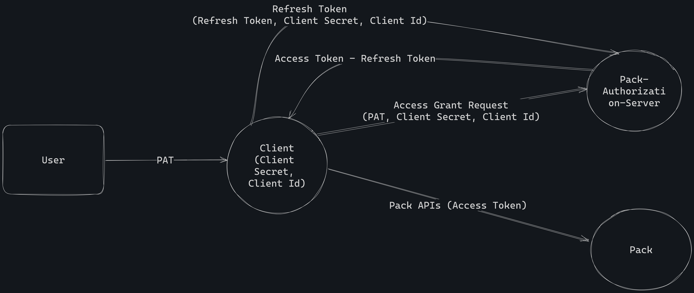

# Tapsi Pack API: OAuth Guide

Welcome to the OAuth guide for the Tapsi Pack API. This guide will help you understand how to authenticate with the
Tapsi Pack API using OAuth.

## Introduction

In this document, external teams integrating with our API are referred to as **clients**. Each client is assigned a
unique **client_secret**.

To access our external APIs, a token must be included in the header of the client's request. This token ensures a secure
access to the APIs and prevents unauthorized access to sensitive data.

The token should be set in the header with the key name **"authorization"**.

There are two types of tokens:

- Client Secret Token
- User Access Token

To obtain your tokens, please contact us at [Tapsi Pack](https://pack.tapsi.ir/landing).



## Token Management for Clients

### 1. Generate Personal Access Token (PAT)

To generate a Personal Access Token (PAT), clients are required to follow these steps:

1. **Navigate to Tapsi Pack External Auth:**
   Clients should direct their users to [Tapsi Pack External Auth](https://pack.tapsi.ir/external-auth).

2. **Client Selection:**
   On the External Auth page, users will encounter a list displaying all available clients within Tapsi Pack. Clients need to choose the specific client they wish to generate a PAT for.

   

3. **Grant Required Access:**
   After selecting a client, users should grant the necessary accesses to the chosen client. This step ensures that the client can perform actions on behalf of the users.

   

4. **View and Copy PAT:**
   Once the required accesses are granted, users will be able to view a PAT. This PAT should be copied and provided to the respective client. Clients will utilize this token to make requests on behalf of the users.


### 2. Generate Access Token and Refresh Token using Client ID and PAT

Clients can generate both an **Access Token** and a **Refresh Token** using their **Client Secret** in combination with the
**user's PAT**. The Access Token that is generated inherits the permissions associated with the corresponding PAT.

The body of the message should be sent as **x-www-form-urlencoded**, and the provided **client secret** should be set as
the **Bearer** authorization header.

URL: 
```
https://api.tapsi.cab/api/v1/delivery/external/oauth2/token
```

Method: 
```
POST
```

Request (as **Form URL Encoded**):

| Field      | Type   | Description        |
|------------|--------|--------------------|
| grant_type | String | authorization_code |
| code       | String | User PAT           |

Response:

```json5
{
  "access_token": "String",
  "refresh_token": "String",
  "scope": "String",
  "token_type": "Bearer",
  "expires_in": "Int"
  // seconds to expiration
}
```

Example Curl:

```bash
curl --location 'https://api.tapsi.cab/api/v1/delivery/external/oauth2/token' \
--header 'Content-Type: application/x-www-form-urlencoded' \
--header 'Authorization: Bearer Client Secret' \
--data-urlencode 'grant_type=authorization_code' \
--data-urlencode 'code=User PAT'
```

### 3. Access Token Expiry

Clients can use the access token until it expires. If a client attempts to use an expired access token, the following
response will be generated.

```text
HTTP/1.1 401 Unauthorized
Content-Type: text

Jwt is expired
```

### 4. Generate a new Access Token and Refresh token using the Refresh token

Clients can use the Refresh Token to generate a new Access Token and Refresh Token without needing to involve the user's
PAT or Client Secret again. This is useful for maintaining continuous access to the API without frequent user interactions.

To generate a new set of tokens using a Refresh Token, clients should make a POST request to the token endpoint, and the
body of the message should be sent as **x-www-form-urlencoded**, and the client secret as the **Bearer** authorization
header.

URL: 
```
https://api.tapsi.cab/api/v1/delivery/external/oauth2/token
```

Method: 
```
POST
```

Request (as **Form URL Encoded**):

| Field         | Type   | Description        |
|---------------|--------|--------------------|
| grant_type    | String | refresh_token      |
| refresh_token | String | User Refresh Token |

Response:

```json5
{
  "access_token": "String",
  "refresh_token": "String",
  "scope": "String",
  "token_type": "Bearer",
  "expires_in": "Int"
  // seconds to expiration
}
```

Example Curl:

```bash
curl --location 'https://api.tapsi.cab/api/v1/delivery/external/oauth2/token' \
--header 'Content-Type: application/x-www-form-urlencoded' \
--header 'Authorization: Bearer Client Secret' \
--data-urlencode 'grant_type=refresh_token' \
--data-urlencode 'refresh_token=User Refresh Token'
```

Currently, the access token is valid for 2 days. When it expires, users need to log in using their
Personal Access Token (PAT) again, following the same process as in [Step 1](#2-generate-access-token-and-refresh-token-using-a-client-secret-and-pat).

---

[](./README.fa.md)
